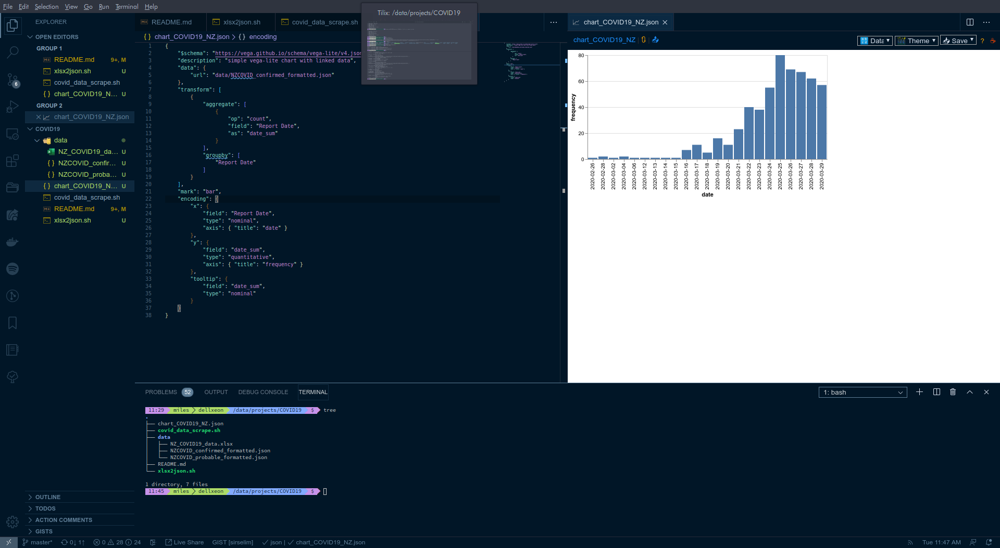

# Readme - playing with NZ COVID19 data

## resources

Data from MoH, (i.e for Mar 30 2020): https://www.health.govt.nz/our-work/diseases-and-conditions/covid-19-novel-coronavirus/covid-19-current-situation/covid-19-current-cases/covid-19-current-cases-details

## setup

**Note:** built in Linux but should run on MacOS and Windows via WSL. It does require a few dependencies:
>  + minconda (if you want to use conda env)
>  + jq
>  + csvkit
>  + xlsx2csv

I might actually design this to work in a docker image. All the above packages are in the debian repos so it would be pretty straight forward.

1. conda 
   *  `conda create --name excel2csv python=3.7`
   *  `conda activate excel2csv`
2. install [xlsx2csv](https://github.com/dilshod/xlsx2csv) and csvkit (for `csvjson`):
   * `easy_install xlsx2csv`
   * `pip install csvkit`
3. download the file from the MoH website, using a bash script:
   * `sh ./covid_data_scrape.sh`
4. string it all together to get a nicely formatted json:
   * `sh ./xlsx2json.sh`
5. there should now be two `json` files in `data/`, one of confirmed cases and one of probable cases.
6. plotting/dashboard... [TO DO]

## working in VSCode

I'm using the [Vega Viewer](https://marketplace.visualstudio.com/items?itemName=RandomFractalsInc.vscode-vega-viewer) extension in VSCode to quickly display the vega-lite charts/plots. Once you have a vega/vega-lite scheme (see `chart_COVID19_NZ.json` as an example) you can use the hot-key combo `Ctrl + Alt + v` to display the plot within VSCode, i.e.:



## Docker

You can build a docker container that will process the data and output the files as needed. The commands below can be used to build and run the container:

```
# Ensure that a folder exists for output data
mkdir -p /tmp/data

# Build the docker container
docker build . -t covidanalysis

# Run the container and mount the temp data folder for output
docker run -d -v /tmp/data:/data covidanalysis
```

You can also build a container that will also host a site displaying the data for you:

```
# Build site container
docker build . -f Dockerfile-site -t covid-site

# Run container hosting webpage on port 80
docker run -d -p 80:80 covid-site

# You can now view the site on http://localhost
```

## TO DO

- [ ] automate last updated date
- [ ] add probable to cumulative cases graph
- [ ] ordering by groups on age and DHB graphs

## appendix

A space for extra notes. Some of the below will be outdated, but keeping for posterity.

The data from the Ministry of Health has dates formatted DD/MM/YYYY, this isn't really compatible with most types of data analysis, which expect YYYY/MM/DD.

* Create a csv:
`xlsx2csv data/NZ_COVID19_data.xlsx > test.csv`  

* Extract the date reported column, sort and count number of confirmed cases per day:
`tail -n +2 test.csv | tr ',' ' ' | awk '{print $1}' | sort -n -k 1.9 -k 1.5 -k 1 | uniq -c`

Better to do it in place:

* Reverse the date format from DD/MM/YYYY to YYYY/MM/DD:
  * a 'simple' sed command:
`sed -r 's/([0-9]{1,2})\/([0-9]{2})\/([0-9]{4})/\3\/\2\/\1/g'`
  * the full command becomes:
`xlsx2csv data/NZ_COVID19_data.xlsx | sed -r 's/([0-9]{1,2})\/([0-9]{2})\/([0-9]{4})/\3\/\2\/\1/g' | csvjson | jq > test.json`

Better yet:

* [old]: ~~`xlsx2csv data/NZ_COVID19_data.xlsx | csvjson | jq > test.json`~~
* [Update]: ~~`xlsx2csv data/NZ_COVID19_data.xlsx | sed -r 's/([0-9]{1,2})\/([0-9]{2})\/([0-9]{4})/\3\\2\/\1/g' | csvjson | jq > data/NZCOVID_formatted.json`~~
* [Update]: It turns out that `xlsx2csv` has a really nice function to convert dates and split out sheets:
  * confirmed cases: `xlsx2csv data/NZ_COVID19_data.xlsx -f %Y/%m/%d -s 1 | tail -n +4 | csvjson | jq > data/NZCOVID_confirmed_formatted.json`
  * probable cases: `xlsx2csv data/NZ_COVID19_data.xlsx -f %Y/%m/%d -s 2 | tail -n +4 | csvjson | jq > data/NZCOVID_probable_formatted.json`